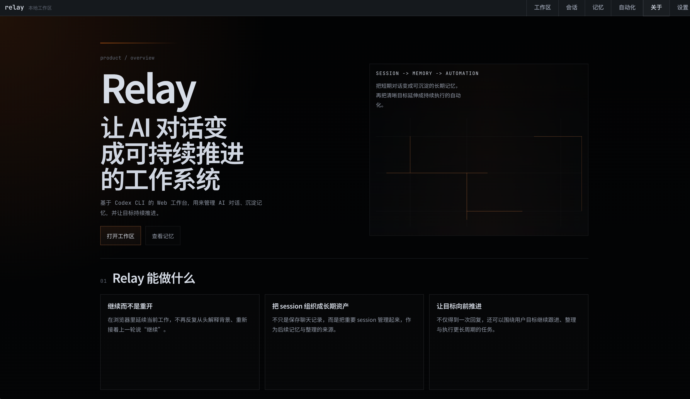
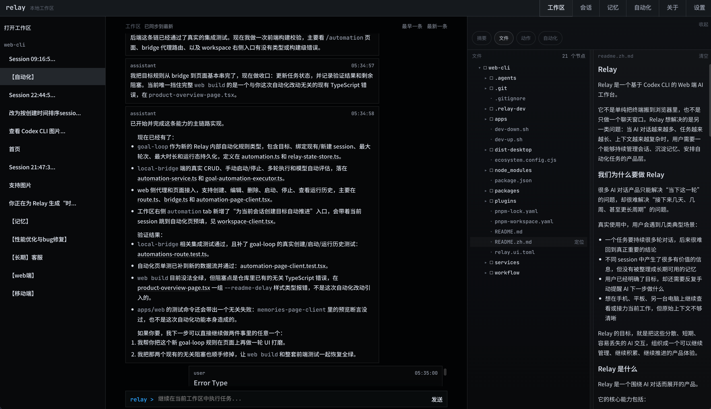
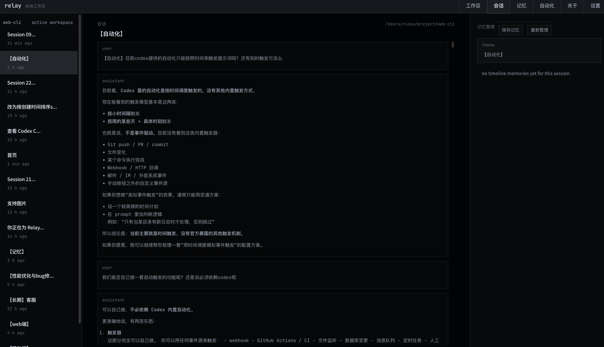
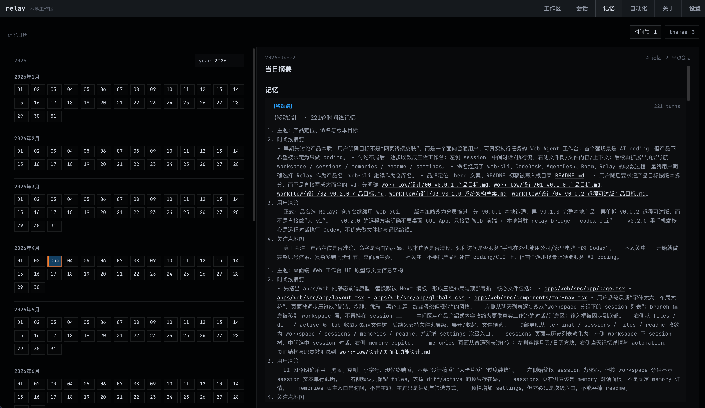
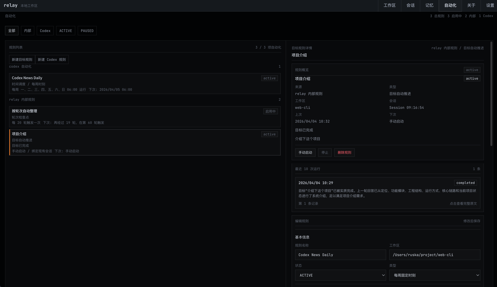
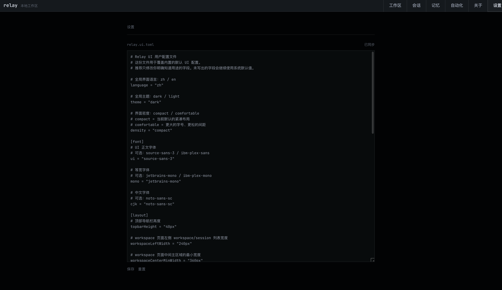

# Relay

Relay is a Codex CLI based web workspace for AI conversations, session management, memory management, and goal-oriented automation.

## Core Value

- Keep work continuous across long-running conversations.
- Turn important sessions into reusable memory.
- Use automation to keep goals moving after the current reply.

## Product Overview

### About / Home

The homepage explains the product model clearly: `Session -> Memory -> Automation`.

### Workspace

Workspace is the main operating surface for continuing tasks, viewing context, and working with files in one place.

### Sessions

Sessions helps users organize conversation history and find the threads that should become long-term assets.

### Memories

Memories turns key session output into structured, durable context that can be retrieved later.

### Automation

Automation lets users define recurring or long-horizon execution tied to concrete goals.

### Settings

Settings are file-driven, so product behavior can be managed through TOML rather than UI toggles.
