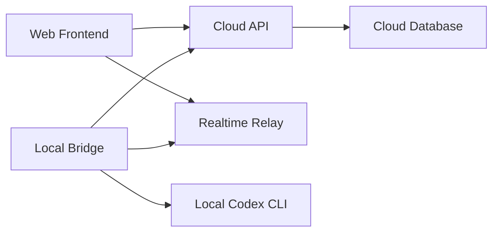

# Relay v0.2.0 系统架构草案

## 1. 文档目的

本文件用于把 `v0.2.0` 的产品目标进一步收敛为系统层设计草案。

重点回答以下问题：

1. `local relay bridge + 云端中继 + Web 前端（桌面 / 手机）` 的系统拓扑是什么
2. 设备、连接、session、memory 的核心数据模型是什么
3. 远程消息流协议如何设计
4. 在线 / 离线 / 重连状态如何定义
5. 这些系统设计会如何反映到页面与交互上

本文件是架构草案，不是最终技术实现规范。

---

## 2. 总体目标

`v0.2.0` 的系统目标是：

让用户通过手机 Web，在非同一网络环境下，稳定接入自己电脑上常驻运行的 `Relay local bridge`，并通过对话方式调用本地 `codex cli` 执行任务，同时保持 session / memory 的多端同步。

系统设计必须优先满足：

- 低延迟
- 持续连接
- 稳定流式返回
- 明确的设备在线状态
- 会话可继续

---

## 3. 系统拓扑

### 3.1 核心组件

`v0.2.0` 建议采用四层结构：

1. `Relay Web Frontend`
2. `Relay Cloud API`
3. `Relay Realtime Relay`
4. `Relay Local Bridge`

其中：

- `Relay Web Frontend`
  - 运行在桌面浏览器或手机浏览器中
  - 提供远程对话和任务状态界面

- `Relay Cloud API`
  - 提供账号、设备、session、memory、同步相关 API
  - 面向 HTTP / REST 或 RPC

- `Relay Realtime Relay`
  - 提供实时连接桥接能力
  - 负责 Web 客户端与本地 bridge 之间的长连接消息转发

- `Relay Local Bridge`
  - 常驻用户电脑
  - 管理本机 workspace
  - 调用本地 `codex cli`
  - 向云端维持长连接
  - 无独立 GUI，不是桌面 app

### 3.2 推荐拓扑图



### 3.3 责任划分

#### Web Frontend

负责：

- 登录
- 展示设备状态
- 选择设备与 workspace
- 输入消息
- 展示流式返回
- 浏览 session / memory

不负责：

- 直接访问本地文件系统
- 直接执行本地命令

#### Cloud API

负责：

- 账号认证
- 设备归属管理
- session / memory 持久化
- workspace 元信息同步
- 配置与用户数据管理

不负责：

- 真正执行本地任务

#### Realtime Relay

负责：

- 维持移动端和桌面端的实时通道
- 转发消息
- 维持会话绑定关系
- 推送设备状态变化

不负责：

- 业务数据持久化

#### Local Bridge

负责：

- 本机登录与设备注册
- workspace 发现与管理
- 调用本地 `codex cli`
- 将本地执行结果转换为流式事件
- 上报设备状态与 session 事件

---

## 4. 连接与通信分层

建议将系统通信拆成两类：

### 4.1 控制面

控制面走 Cloud API。

主要用于：

- 登录
- 获取设备列表
- 获取 workspace 列表
- 获取 session / memory 历史数据
- 更新 memory
- 查询同步状态

特点：

- 强一致性要求较低
- 更适合普通 API 调用

### 4.2 实时面

实时面走 Realtime Relay。

主要用于：

- 输入消息
- 远程任务执行
- token / chunk 流式返回
- 运行状态
- 工具调用状态
- 在线状态变更
- 重连恢复

特点：

- 必须低延迟
- 必须长连接
- 允许事件流式到达

---

## 5. 数据模型草案

以下模型为 `v0.2.0` 的最低必要对象。

### 5.1 User

```ts
type User = {
  id: string;
  email?: string;
  name?: string;
  avatarUrl?: string;
  createdAt: string;
  updatedAt: string;
};
```

### 5.2 Device

设备代表一台运行 `Relay local bridge` 的电脑。

```ts
type DeviceStatus = "online" | "offline" | "connecting" | "error";

type Device = {
  id: string;
  userId: string;
  name: string;
  platform: "macos" | "windows" | "linux";
  agentVersion: string;
  status: DeviceStatus;
  lastSeenAt: string;
  heartbeatAt?: string;
  currentWorkspaceId?: string;
  createdAt: string;
  updatedAt: string;
};
```

关键说明：

- `status` 是产品层状态，不等于底层 socket 状态
- `lastSeenAt` 用于离线判断和排序
- 一个用户可以拥有多个设备

### 5.3 Workspace

```ts
type Workspace = {
  id: string;
  deviceId: string;
  name: string;
  localPath: string;
  branch?: string;
  isActive: boolean;
  lastOpenedAt?: string;
  createdAt: string;
  updatedAt: string;
};
```

关键说明：

- workspace 仍然绑定在某台设备上
- `localPath` 只在可信后端 / local bridge 可见
- 手机端可以显示工作区名，但不一定要暴露完整本地路径

### 5.4 ConnectionSession

用于表示一个手机端和某台设备之间的实时连接会话。

```ts
type ConnectionSessionStatus = "open" | "reconnecting" | "closed";

type ConnectionSession = {
  id: string;
  userId: string;
  deviceId: string;
  clientType: "mobile-web" | "desktop-browser";
  status: ConnectionSessionStatus;
  startedAt: string;
  lastActiveAt: string;
  closedAt?: string;
};
```

这个对象不是聊天 session，而是连接级 session。

### 5.5 Chat Session

```ts
type ChatSession = {
  id: string;
  userId: string;
  deviceId: string;
  workspaceId: string;
  title: string;
  source: "mobile" | "desktop";
  turnCount: number;
  lastMessageAt: string;
  memorySyncStatus: "idle" | "pending" | "completed" | "error";
  createdAt: string;
  updatedAt: string;
};
```

### 5.6 Chat Message

```ts
type ChatMessageRole = "user" | "assistant" | "system" | "tool";

type ChatMessage = {
  id: string;
  sessionId: string;
  role: ChatMessageRole;
  content: string;
  status?: "streaming" | "completed" | "error";
  sequence: number;
  createdAt: string;
  updatedAt: string;
};
```

### 5.7 Runtime Event

这个对象不是最终持久化记录的唯一形式，但它是实时协议的核心。

```ts
type RuntimeEvent =
  | { type: "run.started"; runId: string; sessionId: string; createdAt: string }
  | { type: "message.delta"; runId: string; messageId: string; delta: string; createdAt: string }
  | { type: "message.completed"; runId: string; messageId: string; createdAt: string }
  | { type: "tool.started"; runId: string; toolCallId: string; toolName: string; createdAt: string }
  | { type: "tool.completed"; runId: string; toolCallId: string; createdAt: string }
  | { type: "run.completed"; runId: string; sessionId: string; createdAt: string }
  | { type: "run.failed"; runId: string; sessionId: string; error: string; createdAt: string };
```

### 5.8 MemoryDocument

```ts
type MemoryDocument = {
  id: string;
  userId: string;
  sessionIds: string[];
  index: string;
  title: string;
  date: string;
  contentMd: string;
  source: "manual" | "auto-20-turn";
  createdAt: string;
  updatedAt: string;
};
```

关键说明：

- `index` 用于 `01`、`02` 这类编号
- `contentMd` 为 Markdown 正文
- 内容要求仍然是“按时间线记录过程”，不是只有结论

### 5.9 MemoryAutomationRule

```ts
type MemoryAutomationRule = {
  id: string;
  userId: string;
  type: "turn-count";
  enabled: boolean;
  threshold: number;
  createdAt: string;
  updatedAt: string;
};
```

`v0.2.0` 最低支持：

- `threshold = 20`

---

## 6. 远程消息流协议草案

### 6.1 协议目标

远程协议必须满足：

- 支持低延迟双向消息
- 支持流式返回
- 支持设备状态推送
- 支持任务执行状态推送
- 支持断线后的恢复

### 6.2 协议建议

`v0.2.0` 建议优先采用：

- WebSocket 长连接

理由：

- 浏览器兼容性好
- 双向通信足够
- 实现成本可控
- 更适合作为首版远程协议

后续版本如有必要，再评估 WebRTC DataChannel 或更复杂方案。

### 6.3 基础信封结构

建议所有实时消息使用统一信封：

```ts
type RelayEnvelope<T = unknown> = {
  id: string;
  type: string;
  connectionSessionId: string;
  deviceId: string;
  sessionId?: string;
  runId?: string;
  seq: number;
  ack?: number;
  sentAt: string;
  payload: T;
};
```

字段说明：

- `id`
  - 当前消息唯一 ID
- `seq`
  - 当前连接内递增序号
- `ack`
  - 对端确认已收到的最高序号
- `sessionId`
  - 聊天 session
- `runId`
  - 某次任务执行 ID

### 6.4 客户端到服务端消息

建议最小消息类型：

```ts
type ClientEvent =
  | { type: "auth.bind"; payload: { token: string } }
  | { type: "device.attach"; payload: { deviceId: string } }
  | { type: "workspace.switch"; payload: { workspaceId: string } }
  | { type: "chat.send"; payload: { sessionId?: string; content: string } }
  | { type: "chat.resume"; payload: { sessionId: string } }
  | { type: "ping"; payload: {} };
```

### 6.5 服务端到客户端消息

建议最小消息类型：

```ts
type ServerEvent =
  | { type: "auth.ok"; payload: { userId: string } }
  | { type: "device.status"; payload: { deviceId: string; status: DeviceStatus } }
  | { type: "workspace.switched"; payload: { workspaceId: string } }
  | { type: "chat.accepted"; payload: { sessionId: string; runId: string } }
  | { type: "runtime.event"; payload: RuntimeEvent }
  | { type: "session.updated"; payload: { sessionId: string } }
  | { type: "memory.updated"; payload: { memoryId: string } }
  | { type: "pong"; payload: {} }
  | { type: "error"; payload: { code: string; message: string } };
```

### 6.6 流式消息规则

建议规则：

1. 用户发送 `chat.send`
2. 服务端返回 `chat.accepted`
3. `Relay local bridge` 启动 `codex cli`
4. runtime 流式产生 `runtime.event`
5. 其中 assistant 内容通过多次 `message.delta` 返回
6. 结束后发送 `message.completed` 与 `run.completed`

这样前端可以稳定地做：

- 逐字 / 逐段流式渲染
- 任务进行中状态
- 工具调用状态显示

### 6.7 重连恢复最小策略

当移动端重连后：

1. 客户端重新 `auth.bind`
2. 再次 `device.attach`
3. 上报自己最后确认的 `ack`
4. 服务端补发未确认事件
5. 前端恢复当前 session 的运行态

这是 `v0.2.0` 推荐的最小恢复能力。

---

## 7. 在线 / 离线 / 重连状态机

### 7.1 设备状态机

设备状态建议为：

- `connecting`
- `online`
- `offline`
- `error`

状态定义：

- `connecting`
  - `Relay local bridge` 正在启动或重连中
- `online`
  - 心跳正常，可接受远程连接
- `offline`
  - 心跳超时或主动下线
- `error`
  - agent 存在异常，无法正常服务

### 7.2 客户端连接状态机

移动端连接状态建议为：

- `idle`
- `connecting`
- `attached`
- `reconnecting`
- `disconnected`

状态说明：

- `idle`
  - 尚未尝试连接设备
- `connecting`
  - 正在建立实时连接
- `attached`
  - 已连接到目标设备
- `reconnecting`
  - 网络中断后尝试恢复
- `disconnected`
  - 明确断开，当前不可继续任务

### 7.3 任务状态机

任务执行状态建议为：

- `queued`
- `running`
- `streaming`
- `completed`
- `failed`
- `cancelled`

### 7.4 重连策略草案

`v0.2.0` 建议采用以下重连策略：

1. 短时网络抖动
   - 自动重连
   - 不立刻打断当前阅读界面

2. 重连成功
   - 补发未确认事件
   - 恢复当前 session 状态

3. 多次重连失败
   - 明确切换到 `disconnected`
   - 提示用户重新连接

4. 设备离线
   - 前端展示：
     - `此设备离线，无法执行任务`

### 7.5 心跳建议

建议引入：

- 客户端 ping/pong
- local bridge heartbeat

用途：

- 更快检测断线
- 更准确判定在线状态
- 避免页面看起来“卡住但没提示”

---

## 8. 数据同步策略

### 8.1 session 同步

建议：

- session 内容落库在云端
- 关键事件尽快写入
- 客户端优先展示实时事件，再异步与云端最终一致

### 8.2 memory 同步

建议：

- memory 以 Markdown 文档形式存储
- 同步完整正文
- 存储其来源 session 引用

### 8.3 workspace 同步

建议仅同步 workspace 元信息：

- 名称
- 当前 branch
- 最近打开时间
- 绑定设备

当前版本不建议同步：

- 完整文件树快照
- 文件内容缓存

这样可以降低云端存储与同步负担。

---

## 9. 页面与交互细化建议

系统设计确定后，页面应相应调整。

### 9.1 手机端新增“设备入口”

手机端应新增第一层：

- 设备列表页

展示：

- 设备名称
- 在线状态
- 最近活跃时间
- 当前 workspace

### 9.2 手机端主页面应以对话为核心

手机端主页面建议只保留：

- 顶部设备 / workspace 状态
- 中间对话与流式消息
- 底部输入框

不建议在 `v0.2.0` 强行塞入：

- 文件树
- 复杂右侧上下文
- 高密度三栏布局

### 9.3 桌面端增加“设备状态感知”

桌面端后续也应感知：

- 当前设备是否在线
- 当前 session 是否来自远程端
- 是否被手机端继续使用中

### 9.4 Sessions / Memories 继续保持桌面优先

`v0.2.0` 中：

- `sessions`
  - 继续以桌面端为主的整理界面
- `memories`
  - 以同步查看为主
  - 手机端可简化

因为当前版本的核心新增价值在远程执行，而不是远程知识编辑。

---

## 10. 推荐工程拆分顺序

建议按以下顺序推进：

1. 定义 `local relay bridge` 最小职责与本地进程模型
2. 搭建云端设备注册与在线状态 API
3. 建立 WebSocket 中继链路
4. 打通手机端发送消息 -> `Relay local bridge` -> `codex cli` -> 流式返回
5. 落库 session
6. 落库 memory
7. 增加重连与恢复
8. 再补移动端页面体验优化

---

## 11. 当前最关键的风险

### 11.1 性能风险

如果中继层设计不当，会直接损害：

- 流式体验
- 连接稳定性
- 用户对产品核心价值的判断

### 11.2 状态一致性风险

如果 session、runtime event、云端持久化三者关系不清晰，会导致：

- 页面显示和真实执行脱节
- 多端看到不同状态
- 重连后界面恢复错误

### 11.3 版本膨胀风险

如果在 `v0.2.0` 同时追求：

- 文件树
- 深度编辑
- 高级 memory 工作流
- 复杂设备系统

会直接稀释“远程接入本地 Codex”这个最核心目标。

---

## 12. 结论

`v0.2.0` 的本质不是“多端 UI 版本”，而是“远程接入本地 agent 的第一版可用系统”。

因此系统设计的关键不是页面多漂亮，而是：

- 设备如何在线
- 消息如何流
- 断线如何恢复
- 数据如何同步

只要这四件事成立，Relay 才真正开始从本地原型走向具有远程使用价值的产品。
