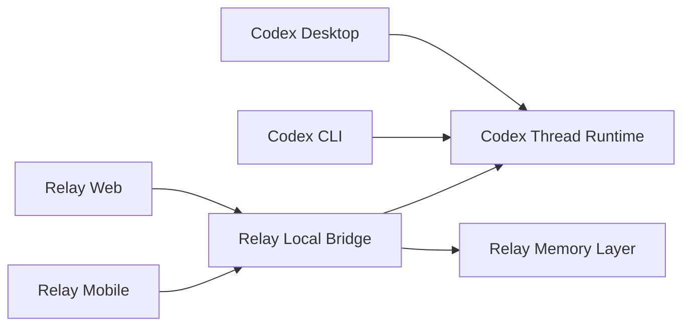
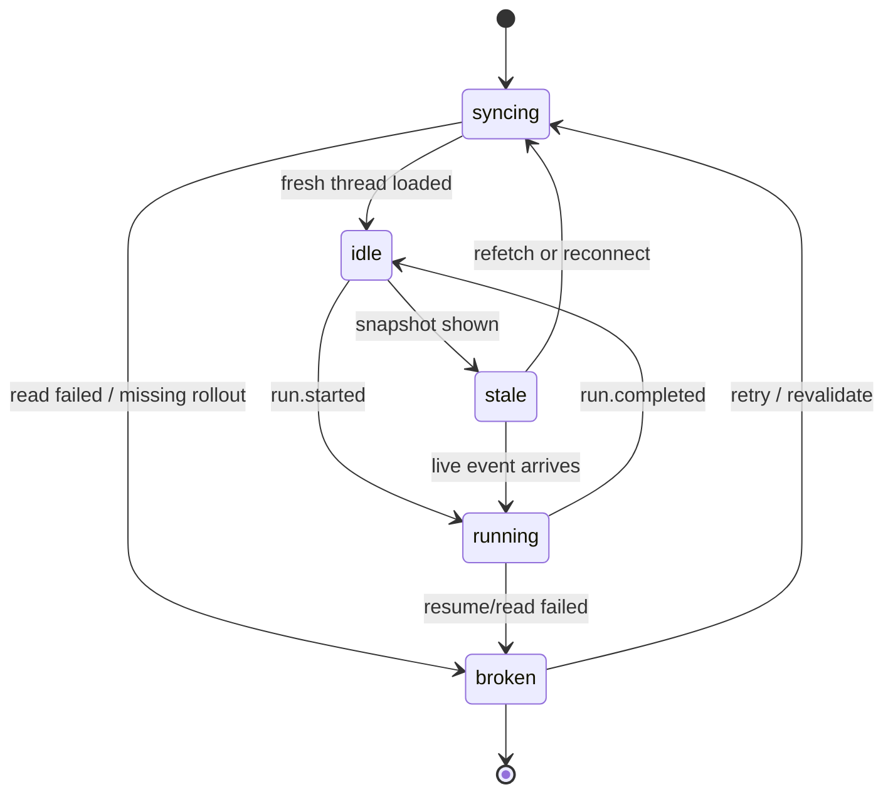
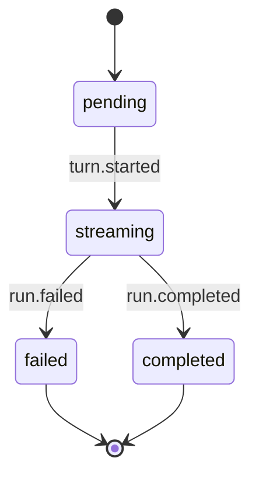
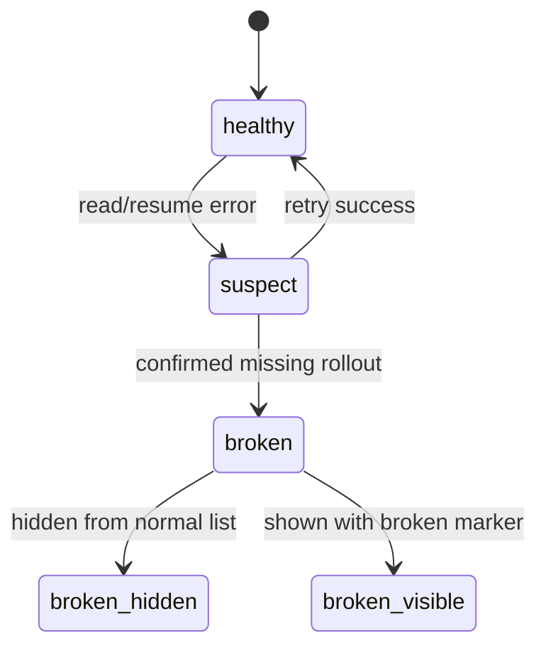
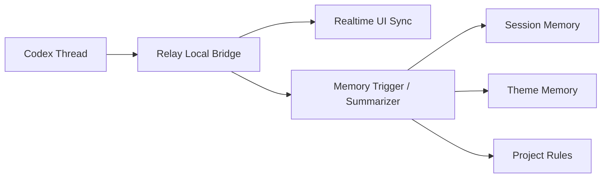

# Relay v0.1.0 统一实时会话架构设计

## 1. 文档目的

本文件用于把 `v0.1.0` 的“统一实时会话架构”目标收敛为系统设计。

重点回答以下问题：

1. Relay 与 Codex Desktop / CLI 的关系应该如何定义
2. 为什么现有“复用 Codex thread + 本地缓存”还不足以支持多端实时同步
3. `local-bridge` 应该如何成为统一实时同步网关
4. 多端围绕同一条 thread 对话时，协议层如何设计
5. thread 的状态机如何定义，坏 thread 如何降级
6. memory 系统如何继续作为 thread 之上的派生层存在

本文件是架构设计文档，不是最终实现细节手册。

---

## 2. 总体目标

`v0.1.0` 的系统目标是：

让 `Codex Desktop / Codex CLI / Relay Web / Relay Mobile` 都能够围绕同一条 `Codex thread` 工作，并保持：

- 对话真相唯一
- 增量消息实时同步
- 外部修改可见
- 坏 thread 可隔离
- memory 能异步沉淀，但不污染主对话链路

系统设计必须优先满足：

- 单一真相源
- 实时性
- 降级安全
- 多端一致性
- 对 Codex 底层变化的低耦合

---

## 3. 核心判断

### 3.1 真相源定义

本版本明确规定：

- `Codex thread` 是唯一会话真相源
- Relay 不再被视为另一套 session 真相系统

这意味着：

- Relay 的 snapshot / cache / optimistic UI 都只是性能和体验层
- Relay 不能维护一套独立消息历史并把它当最终状态
- 真正影响 thread 的写操作必须回到 Codex thread 上执行

### 3.2 产品层对象关系

本版本采用以下对象分层：

- `Codex thread`
  - 对话真相
  - 运行状态
  - 标题
  - 归档状态
  - cwd / workspace

- `Relay thread view`
  - thread 的产品化视图
  - 可附带：
    - snapshot source
    - syncState
    - brokenReason
    - UI 偏好

- `Relay memory`
  - 对 thread 的异步派生产物
  - 包括：
    - session memory
    - theme memory
    - project rules

### 3.3 多端协作定义

本版本中“多端协作”明确等于：

- 多个端围绕同一条 thread 工作
- 任何一端发送输入，都写入同一个真相源
- 任何一端收到 thread 变化，其他端也可看到对应变化

本版本不接受以下模式：

- 每个端分别维护本地会话副本
- 通过低频全量刷新来伪装实时同步

---

## 4. 总体架构

### 4.1 核心组件

`v0.1.0` 建议采用四层结构：

1. `Codex Thread Runtime`
2. `Relay Local Bridge`
3. `Relay Web / Mobile Clients`
4. `Relay Memory Layer`

其中：

- `Codex Thread Runtime`
  - 由 `codex app-server` 提供 thread / turn 真相
  - 负责真实的 thread 生命周期

- `Relay Local Bridge`
  - 统一调用 Codex app-server
  - 统一输出列表、详情、运行与实时事件
  - 统一做坏 thread 识别与降级

- `Relay Web / Mobile Clients`
  - 只消费 bridge 提供的稳定 API 和事件流
  - 不直接猜测 Codex 内部状态

- `Relay Memory Layer`
  - 消费 thread 结果或 thread 事件
  - 异步生成记忆沉淀

### 4.2 推荐拓扑图



### 4.3 责任划分

#### Codex Thread Runtime

负责：

- `thread/list`
- `thread/read`
- `thread/start`
- `thread/resume`
- `thread/name/set`
- `thread/archive`
- `turn/start`
- 增量通知流

不负责：

- Relay 页面组织
- memory 沉淀
- 产品层快捷动作和主题归档

#### Relay Local Bridge

负责：

- 汇总 Codex thread 视图
- 提供列表 / 详情 / 运行 / 实时订阅
- 写后重读
- 坏 thread 识别与隔离
- 将 thread 事件转换为前端稳定事件

不负责：

- 自建独立会话真相

#### Relay Web / Mobile

负责：

- thread 展示
- 用户输入
- 实时渲染
- stale / broken / running 等状态表达

不负责：

- 自己决定 thread 真相

#### Relay Memory Layer

负责：

- session memory
- theme memory
- project rules

不负责：

- 主对话实时同步

---

## 5. 通信分层

建议将系统通信拆成两类：

### 5.1 控制面

控制面走普通 HTTP API。

主要用于：

- 读取 workspace 列表
- 读取 thread 列表
- 读取 thread 详情
- 写入 rename / archive / select
- memory 读取与保存

特点：

- 可缓存
- 可走 snapshot
- 允许短暂 stale

### 5.2 实时面

实时面走长连接事件流。

首版建议：

- `SSE`

原因：

- 实现简单
- 单向推送足够满足“一个真相源，多端订阅”
- 对现有前端接入成本低

主要用于：

- run started
- message delta
- message completed
- run completed / failed
- title changed
- archived
- broken

特点：

- 低延迟
- 单 thread 可增量同步
- 前端不靠轮询刷新

---

## 6. 协议层设计

### 6.1 控制面 API

建议继续保留并强化以下 API：

- `GET /sessions`
- `GET /sessions/:id`
- `POST /sessions/:id/select`
- `POST /sessions/:id/rename`
- `POST /sessions/:id/archive`
- `POST /runtime/run`

约束：

- 所有写操作写后重读
- 所有详情读取都可返回：
  - `fresh`
  - `snapshot`
- `broken thread` 需以稳定结构返回，而不是直接把错误抛给 UI

### 6.2 实时订阅 API

建议新增：

- `GET /stream/threads`

支持 query 参数：

- `threadId`
- `workspaceId`
- `since`

首版语义：

- 允许按单 thread 订阅
- 允许按 workspace 范围订阅
- `since` 用于断线重连后补齐增量

### 6.3 事件结构

统一事件结构建议如下：

```ts
type RelayThreadEvent = {
  id: string;
  type:
    | "thread.updated"
    | "thread.archived"
    | "thread.broken"
    | "run.started"
    | "message.delta"
    | "message.completed"
    | "run.completed"
    | "run.failed";
  threadId: string;
  workspaceId?: string;
  occurredAt: string;
  sequence: number;
  payload: Record<string, unknown>;
};
```

要求：

- `id` 保证事件幂等消费
- `sequence` 用于同一 thread 内顺序控制
- `payload` 保持按事件类型最小必要字段

### 6.4 事件示例

#### `run.started`

```json
{
  "id": "evt_001",
  "type": "run.started",
  "threadId": "thread_123",
  "workspaceId": "workspace_abc",
  "occurredAt": "2026-04-03T16:00:00.000Z",
  "sequence": 120,
  "payload": {
    "turnId": "turn_789"
  }
}
```

#### `message.delta`

```json
{
  "id": "evt_002",
  "type": "message.delta",
  "threadId": "thread_123",
  "occurredAt": "2026-04-03T16:00:01.200Z",
  "sequence": 121,
  "payload": {
    "turnId": "turn_789",
    "messageId": "msg_assistant_1",
    "delta": "正在继续输出..."
  }
}
```

#### `thread.broken`

```json
{
  "id": "evt_003",
  "type": "thread.broken",
  "threadId": "thread_123",
  "occurredAt": "2026-04-03T16:01:00.000Z",
  "sequence": 122,
  "payload": {
    "reason": "missing_rollout"
  }
}
```

### 6.5 snapshot 与实时事件合并规则

前端必须遵守以下读取顺序：

1. 先显示 snapshot
2. 标记 `syncState = stale`
3. 建立实时订阅
4. 拉一次 fresh 详情
5. 之后持续合并事件流

不允许：

- snapshot 显示后长期不校验 fresh
- 新事件到来却被旧 snapshot 覆盖

---

## 7. 状态机设计

### 7.1 thread 状态机

thread 推荐状态机如下：



状态说明：

- `syncing`
  - 正在读取或重建 thread 最新状态

- `idle`
  - thread 可读，当前无活动 run

- `running`
  - 当前 thread 正在生成

- `stale`
  - 当前显示的是快照，不是已确认真相

- `broken`
  - thread 在索引中仍存在，但底层不可读或不可恢复

### 7.2 run 状态机

单次 run 推荐状态机如下：



约束：

- 同一 thread 同时最多一个活动 run
- 若另一个端正在运行，本端必须给出明确提示

### 7.3 坏 thread 状态机



设计要求：

- 系统内部要能先经历 `suspect`
- 对用户展示时可以直接映射成 `broken`

---

## 8. 坏 thread 隔离策略

### 8.1 识别条件

以下错误应优先判定为坏 thread：

- `No such file or directory`
- `missing rollout`
- `no rollout found for thread id`

但不能把所有读取失败都视为坏 thread。

例如以下情况应视为可重试：

- app-server 暂时不可用
- bridge 连接断开
- 临时 I/O 错误

### 8.2 列表展示策略

首版建议：

- 正常列表默认不显示坏 thread
- 若产品需要保留可见性，则必须用独立样式和文案标记

原因：

- 用户不应把不可恢复 thread 继续当成可对话对象

### 8.3 详情展示策略

若用户通过直链或历史状态进入坏 thread：

- 不显示正常对话界面
- 显示：
  - 已损坏
  - 无法读取底层记录
  - 可尝试重新校验

### 8.4 修复策略

本版本不强制做“自动修复”，但要为后续预留：

- 清理坏索引
- 标记不可恢复
- 后台排障工具

---

## 9. 缓存与一致性策略

### 9.1 snapshot 原则

snapshot 只用于：

- 快速首屏
- 断线恢复时的临时显示

snapshot 不用于：

- 长期替代 fresh
- 决定 thread 是否可继续对话

### 9.2 cache 原则

缓存只用于减少重复请求。

缓存必须具备以下失效条件：

- workspace 切换
- window refocus
- 页面恢复
- thread 写操作完成
- 外部端事件到达

### 9.3 写后重读原则

所有以下操作必须：

- 写入 Codex
- 再读回 thread
- 再广播事件

覆盖操作：

- thread start
- turn start
- rename
- archive

### 9.4 外部变更可见性

若 Desktop / CLI 发生变更：

- bridge 应尽快广播相应事件
- Web / Mobile 不应等待用户手动刷新才看见

---

## 10. memory 层位置

本版本必须明确：

- memory 不是 thread 真相的一部分
- memory 是 thread 之上的异步派生层

建议链路：



这意味着：

- 主对话失败不能因为 memory 失败而失败
- memory 可以慢一些，但 thread 同步必须优先保证

---

## 11. 可观测性建议

为保证后续能持续优化，建议至少记录：

- thread 打开耗时
- snapshot 到 fresh 的切换耗时
- 首条 `message.delta` 延时
- run 完成耗时
- SSE 断线重连次数
- 坏 thread 数量
- 坏 thread 被命中的频率

没有这些指标，就无法判断“多端实时同步”是否真的达到目标。

---

## 12. 成功标准

本设计落地后，至少应满足：

- Codex thread 作为唯一会话真相源被明确贯彻
- Relay Web / Mobile 可以围绕同一条 thread 实时同步
- 缓存与 snapshot 不再被误当成真相
- 坏 thread 被正确识别和隔离
- memory 继续作为增强层存在，而不侵入主对话链路

如果没有做到这些，即使页面更快、视觉更好，也不能视为“统一实时会话架构”真正成立。
