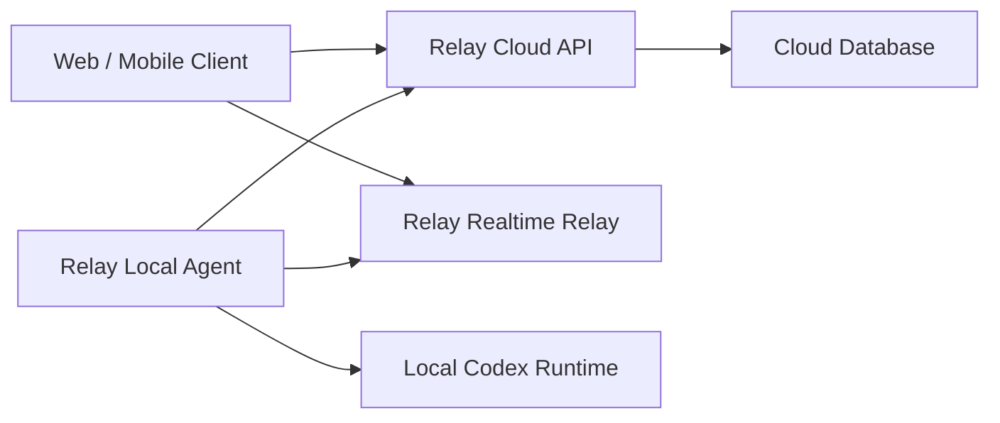
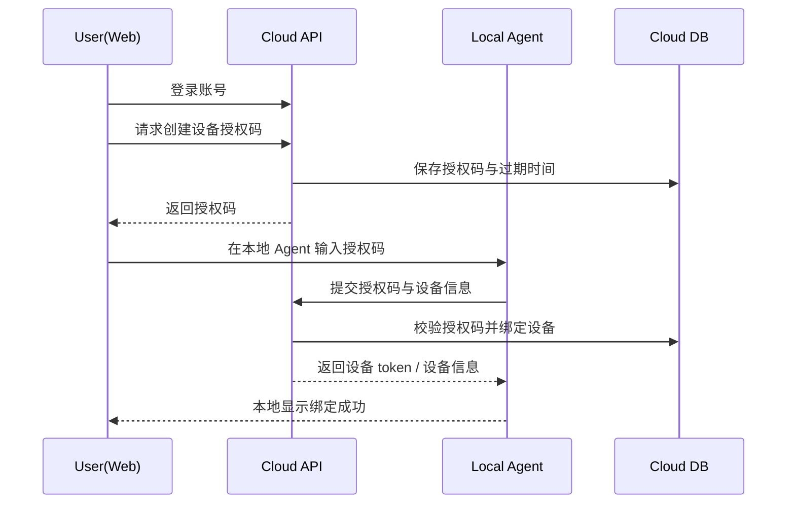
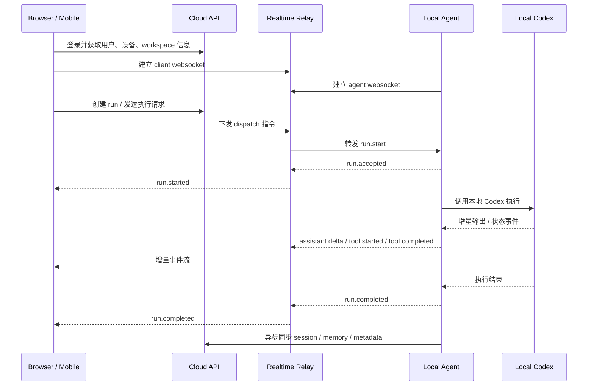
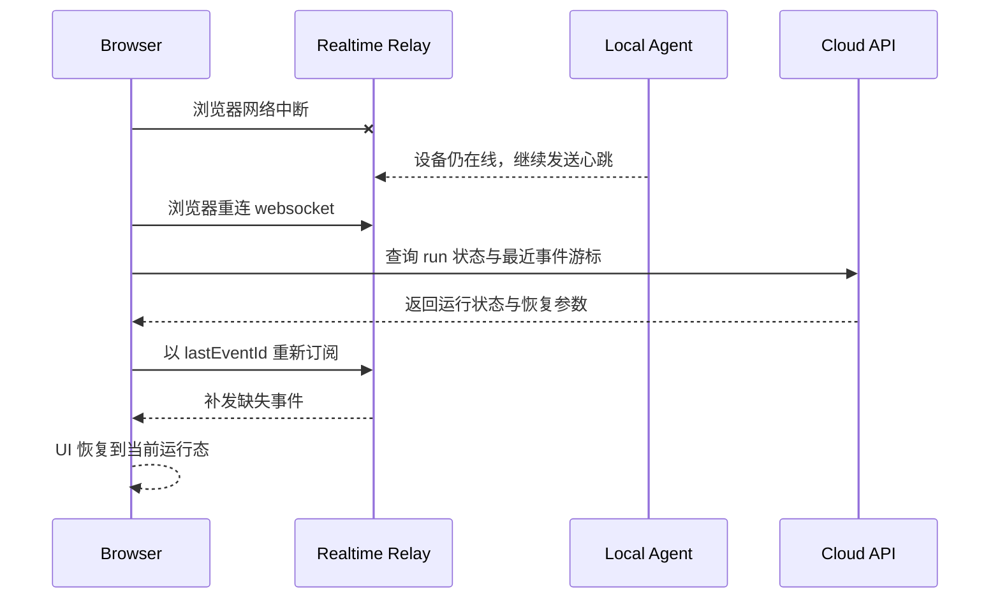
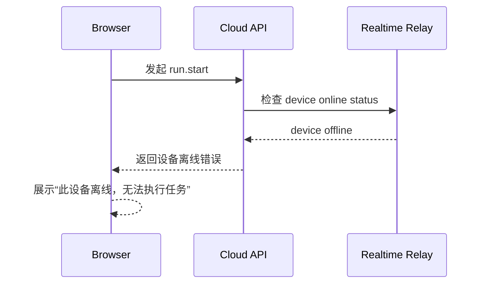

# Relay v0.2.0 远程接入性能与工程设计

## 1. 文档目的

本文件用于把 Relay `v0.2.0` 的“账号登录后在网页端访问自己本地 Codex”目标，收敛为一份可落地的工程设计文档。

本文件重点回答以下问题：

1. 为什么公网平台版不能继续停留在 `web + local-bridge + tunnel` 的结构上
2. 账号登录后访问本地 CLI 的推荐系统拓扑是什么
3. 这条链路的时序如何设计，首包和流式性能会慢在哪里
4. 系统应该如何做性能预算与稳定性预算
5. 应该优先做哪些性能优化，哪些体验问题必须提前规避
6. 结合当前仓库实现，哪些能力已经具备，哪些能力仍然缺失
7. 当前代码库应该如何从现状演进到 `v0.2.0`

本文件是工程设计文档，不是最终接口契约文档，也不是具体开发任务拆解单。

---

## 2. 背景与前因后果

### 2.1 当前产品阶段

结合当前仓库实现，Relay 已经具备以下本地能力：

- `apps/web`
  - 提供桌面 Web 与移动 Web 页面骨架
- `services/local-bridge`
  - 提供本地桥接服务
  - 调用本地 Codex app-server / CLI
  - 提供 session / workspace / memory / automation / runtime API
- Web 通过 `/api/bridge/*` 代理访问本地 bridge
- 已有运行时流式事件链路
- 已有会话、记忆、自动化、工作区等核心对象模型

这意味着当前 Relay 已经不再是“概念原型”，而是一个可以在本机工作、可持续演进的本地工作台。

### 2.2 当前结构的能力边界

当前结构的核心链路是：

```text
Relay Web
  -> /api/bridge/*
  -> Relay local-bridge
  -> local Codex
```

这一结构非常适合：

- 本地电脑使用
- 同机或同局域网访问
- 单用户本地工作流

但它不适合直接升级为“任何人登录账号后，访问自己本地电脑上的 CLI”的公网产品，原因如下：

- 浏览器不能直接安全访问用户本地 CLI
- 用户电脑通常在 NAT 或公司网络之后，无法被云端直接反向访问
- 不能要求用户手工做端口映射
- 不能把本地 bridge 直接暴露到公网
- 多用户登录后，必须有设备归属和权限模型
- 远程访问需要设备在线状态、重连和中继能力

### 2.3 当前文档与本文件的关系

本文件建立在以下背景文档之上：

- `04-v0.0.2-远程可达版产品目标`
  - 解决“个人远程访问自己的电脑”
- `02-v0.2.0-产品目标`
  - 定义账号、设备、远程访问、多端同步的产品目标
- `03-v0.2.0-系统架构草案`
  - 提出 `Web Frontend + Cloud API + Realtime Relay + Local Bridge` 的四层结构
- `06-v0.1.0-统一实时会话架构设计`
  - 为运行时事件流、thread 真相源和本地 bridge 打下基础

本文件的角色不是重复这些目标文档，而是补齐以下内容：

- 更工程化的时序图
- 更明确的性能预算
- 更具体的稳定性与流畅性保障策略
- 当前仓库现状与目标形态之间的差距分析

---

## 3. 目标定义

### 3.1 产品目标

`v0.2.0` 的目标不是简单把本地 Web 暴露到公网，而是交付这样一种能力：

- 用户拥有一个 Relay 账号
- 用户在自己的电脑上运行一个常驻的本地 Agent
- 用户在网页端或手机端登录该账号
- 用户选择自己名下在线的设备
- 用户在网页端继续驱动该设备上的本地 Codex 执行任务
- 结果以流式方式稳定返回

### 3.2 技术目标

系统在工程层需要满足以下目标：

- 用户电脑不需要公网 IP
- 用户电脑不需要做端口映射
- 本地 CLI 执行权限始终保留在用户设备上
- 网页端不直接访问本地文件系统或本地命令执行能力
- 远程链路具备低延迟、持续连接、可重连能力
- 系统对慢网、抖动网络和临时断线有清晰的降级行为

### 3.3 性能目标

本版本的性能目标不是追求极限吞吐，而是追求用户体感上的“快、稳、持续反馈”。

产品体验的优先顺序如下：

1. 发出请求后很快得到确认
2. 很快看到第一段返回
3. 流式输出持续稳定
4. 中途断线可恢复
5. 状态可解释，不出现“无反馈卡死”

---

## 4. 核心判断

### 4.1 不应采用的错误方案

本版本明确不建议采用以下方案：

#### 方案 A：浏览器直接访问本地 bridge

不可取，原因如下：

- 无法穿透用户网络环境
- 安全边界不成立
- 用户侧配置复杂
- 对多用户账号系统不友好

#### 方案 B：云端轮询任务，本地 agent 轮询领取

可实现，但体验通常较差，原因如下：

- 首包慢
- 中途状态抖动明显
- 流式输出不连续
- 长任务时轮询成本高

#### 方案 C：直接把本地 bridge 通过 tunnel 暴露给所有账号用户

只适合 `v0.0.2` 的个人原型，不适合作为正式平台方案，原因如下：

- 难以建立稳定的账号与设备归属
- 难以支持多设备、多端会话和统一在线状态
- 安全与审计边界弱
- 设备级接入体验不可产品化

### 4.2 推荐的正确方向

本版本建议坚持以下结构：

- 浏览器只连接云端
- 本地 Agent 主动连接云端
- 云端负责账号、设备归属和实时转发
- 本地执行始终发生在用户设备上

这意味着，Relay 的正式平台形态应当是：



---

## 5. 总体架构

### 5.1 核心组件

本版本建议采用四层结构：

1. `Relay Web Frontend`
2. `Relay Cloud API`
3. `Relay Realtime Relay`
4. `Relay Local Agent`

### 5.2 组件职责

#### Relay Web Frontend

负责：

- 账号登录
- 设备列表展示
- 设备在线状态展示
- workspace / session 浏览
- 发送用户输入
- 展示流式返回
- 展示错误与重连状态

不负责：

- 直接访问本地命令执行
- 直接访问本地文件系统

#### Relay Cloud API

负责：

- 用户认证
- 设备注册与绑定
- 设备归属校验
- workspace / session / memory 元数据读写
- 在线状态查询
- 配置下发

不负责：

- 执行本地任务
- 直接产生流式 token

#### Relay Realtime Relay

负责：

- 维护浏览器与本地 Agent 的双向长连接
- 按设备路由实时消息
- 转发运行状态和流式输出
- 推送设备状态变化
- 管理心跳、重连、背压、运行中断

不负责：

- 充当业务数据真相源

#### Relay Local Agent

负责：

- 在用户电脑上常驻运行
- 登录账号并绑定设备
- 维持到云端的长连接
- 管理本地 workspace
- 调用本地 Codex
- 将本地执行事件转发到云端
- 在必要时本地缓存快照

不负责：

- 让云端直接拥有本地系统权限

### 5.3 当前仓库中可复用的部分

从当前代码结构看，下列模块可直接复用或演进：

- `services/local-bridge`
  - 可以演进为 `Relay Local Agent` 的本地执行核心
- runtime event 模型
  - 可继续作为浏览器与本地执行间的事件语义基础
- workspace / session / memory / automation 存储与视图逻辑
  - 可作为本地 Agent 侧和云端控制面的初始模型参考
- `apps/web`
  - 可演进为正式前端客户端

---

## 6. 关键数据与连接模型

### 6.1 最低必要对象

本版本最低需要以下对象：

- `User`
- `Device`
- `Workspace`
- `Session`
- `Run`
- `Memory`
- `RealtimeConnection`

### 6.2 Device 模型

`Device` 是本版本的关键对象。

建议至少包含：

```ts
type DeviceStatus = "online" | "offline" | "connecting" | "degraded" | "error";

type Device = {
  id: string;
  userId: string;
  name: string;
  platform: "macos" | "windows" | "linux";
  agentVersion: string;
  status: DeviceStatus;
  lastSeenAt: string;
  heartbeatAt?: string;
  activeWorkspaceId?: string | null;
  createdAt: string;
  updatedAt: string;
};
```

### 6.3 Realtime Connection 模型

建议区分两类长连接：

- `client connection`
  - 浏览器与 Relay Realtime Relay 的连接
- `agent connection`
  - 本地 Agent 与 Relay Realtime Relay 的连接

系统必须能回答以下问题：

- 某个用户当前有哪些浏览器连接
- 某台设备当前是否在线
- 某台设备的哪个连接可接收运行请求
- 某次运行对应哪个设备、哪个 session、哪个浏览器订阅者

### 6.4 Run 模型

建议将一次远程执行显式建模为 `Run`：

```ts
type RunStatus =
  | "queued"
  | "dispatching"
  | "running"
  | "completed"
  | "failed"
  | "cancelled"
  | "timed_out";

type Run = {
  id: string;
  userId: string;
  deviceId: string;
  workspaceId: string;
  sessionId: string;
  status: RunStatus;
  startedAt?: string;
  completedAt?: string;
  lastEventAt?: string;
};
```

这样做的好处是：

- 可以更清楚地跟踪一次执行的状态
- 可以实现重连后的运行态恢复
- 可以做超时、取消和审计

---

## 7. 关键链路时序图

### 7.1 设备注册与绑定时序

建议本地 Agent 采用“网页登录生成授权码，本地 Agent 输入授权码绑定”的方式接入。



### 7.2 浏览器发起远程执行的主时序

这是本版本最关键的主链路。



### 7.3 断线重连与恢复时序



### 7.4 离线设备失败时序



---

## 8. 性能分析

### 8.1 用户体感由什么决定

在本版本中，用户体感主要由以下三个时间段决定：

1. `T_ack`
   - 用户点击发送后，到看到“已接收请求”或“设备处理中”
2. `T_first_chunk`
   - 用户点击发送后，到看到第一段 AI / runtime 返回
3. `T_stream_gap`
   - 在流式过程中，相邻两段可见输出之间的时间间隔

用户通常不会精确感知后端链路耗时，但会敏感地感知以下问题：

- 发出请求后长时间没有任何反馈
- 第一段输出出来太慢
- 输出一会儿停一会儿
- 状态不清楚，不知道是在执行、断线还是失败

### 8.2 典型延迟分解

一次远程执行的时间可粗略拆成：

```text
总首包延迟
= 前端发起请求
+ Cloud API 认证与入队
+ Relay 到 Agent 路由
+ Agent 接收并调用本地 Codex
+ Codex 产生第一段输出
+ Agent / Relay / Browser 转发与渲染
```

这里真正决定体感的通常不是云端转发本身，而是：

- 本地 Codex 是否冷启动
- Agent 是否常驻且已建立长连接
- 事件是否过于碎片化
- 前端是否过于频繁重渲染

### 8.3 性能预算原则

性能预算应以“用户可感知体验”为目标，而不是单纯以单点服务响应时间为目标。

建议将性能预算分成：

- 首包预算
- 稳态流式预算
- 重连恢复预算

---

## 9. 性能预算表

以下预算为建议目标值，不是严格 SLA。其目的是指导工程决策与性能排查。

### 9.1 交互预算

| 指标 | 目标值 | 可接受上限 | 说明 |
|---|---:|---:|---|
| 用户点击发送到本地 UI 进入 pending | `< 100ms` | `200ms` | 前端本地状态更新，不应依赖网络 |
| 用户点击发送到服务端确认接收 `T_ack` | `< 400ms` | `800ms` | 包括认证、路由和 run 建立 |
| 用户点击发送到看到 `run.started` | `< 700ms` | `1200ms` | 包括 Agent 接收确认 |
| 用户点击发送到第一段输出 `T_first_chunk` | `1.0s - 2.5s` | `4.0s` | 主要受本地 Codex 首包影响 |
| 流式输出可见刷新间隔 `T_stream_gap` | `< 200ms` | `500ms` | 大于此值时用户会感觉断断续续 |
| 浏览器重连后恢复运行状态 | `< 1.5s` | `3.0s` | 包括补发缺失事件 |

### 9.2 服务端预算

| 环节 | 目标值 | 可接受上限 | 备注 |
|---|---:|---:|---|
| Cloud API 认证与权限校验 | `< 80ms` | `150ms` | 热路径应尽量短 |
| 创建 run / dispatch 指令 | `< 80ms` | `150ms` | 不应包含重逻辑 |
| Relay 路由到在线 Agent | `< 50ms` | `120ms` | 内存态路由优先 |
| Agent 确认接收 run | `< 150ms` | `300ms` | 不应等待完整执行开始 |
| 单个实时事件经 Relay 转发 | `< 30ms` | `80ms` | 正常负载下应足够轻 |

### 9.3 Agent 侧预算

| 环节 | 目标值 | 可接受上限 | 备注 |
|---|---:|---:|---|
| Agent 常驻心跳抖动 | `< 5s` | `10s` | 用于在线态判断 |
| Agent 收到请求到调用本地 Codex | `< 150ms` | `400ms` | 不要额外做重逻辑 |
| 冷启动预热完成时间 | `< 3s` | `8s` | 启动期可接受，运行期不应反复发生 |
| 事件聚合窗口 | `30ms - 80ms` | `120ms` | 防止过碎事件冲击链路 |

### 9.4 在线状态预算

| 指标 | 目标值 | 可接受上限 | 备注 |
|---|---:|---:|---|
| 设备离线判定延迟 | `10s - 20s` | `30s` | 太短会误判，太长会误导用户 |
| 设备上线到前端可见 | `< 3s` | `6s` | 依赖心跳与状态广播 |

### 9.5 对预算的解释

本预算强调以下原则：

- `run.started` 必须尽快出现
- 第一段输出允许比 `run.started` 慢，但不能长期无反馈
- 流式内容不要求逐 token 呈现，只要求持续、顺滑、低抖动
- 离线与断线要有可解释行为，而不是沉默失败

---

## 10. 流畅体验的三项核心优化清单

### 10.1 首包延迟优化清单

目标是尽快把 `T_ack` 和 `T_first_chunk` 压下来。

建议优先做以下优化：

1. Agent 常驻，禁止按次启动
   - 本地 Agent 必须常驻运行
   - 不允许每次执行时再启动整套连接链路

2. Agent 与 Relay 保持热连接
   - 浏览器与 Agent 都维持 websocket
   - 发起执行时不再额外建连接

3. 本地 Codex 尽量预热
   - 应尽可能复用已有 thread / runtime
   - 避免每次消息都重新冷启动重型上下文

4. `run.started` 和第一段输出分离
   - Agent 一收到请求就立刻确认 `run.accepted`
   - Browser 尽快收到 `run.started`
   - 不要等第一段 AI 输出后才告诉用户“任务开始了”

5. 热路径不做重型数据库逻辑
   - API 创建 run 与权限校验必须轻
   - 不要在热路径同步写大量 session / memory 数据

6. 请求路径优先内存路由
   - Realtime Relay 应尽量通过内存中的在线设备映射路由
   - 不要每次 dispatch 都回数据库做重查询

### 10.2 流式稳定性优化清单

目标是把 `T_stream_gap` 控制在可接受范围内，让输出看起来连续。

建议优先做以下优化：

1. 事件粒度不要过碎
   - 不要求逐 token 上屏
   - 采用小块增量文本 `assistant.delta`
   - 通过 30ms 到 80ms 的聚合窗口控制事件频率

2. 前端做渲染节流
   - 流式到达的事件不要每条都触发整棵组件树重渲染
   - 消息列表、输入框、侧栏状态分离

3. 大列表懒加载和虚拟化
   - session 列表、消息长历史、memory 列表要避免一次性完整渲染

4. 控制面与实时面隔离
   - 流式输出走 websocket
   - session / memory 元数据走普通 API
   - 不要用数据库轮询模拟实时

5. Relay 做轻量转发，不做流中重加工
   - 中继只负责路由、鉴权、订阅与背压
   - 不要在每个事件上做重型业务逻辑

6. 浏览器断网恢复后支持补发
   - 基于 `lastEventId` 或游标补发缺失事件
   - 避免重连后整段内容丢失或整页重刷

### 10.3 重连与稳定性优化清单

目标是让系统在真实网络环境下仍然稳，而不是实验室里才快。

建议优先做以下优化：

1. 明确心跳机制
   - Agent 定期上报心跳
   - Relay 根据超时窗口更新在线态

2. 明确断线状态机
   - `online`
   - `connecting`
   - `degraded`
   - `offline`
   - `error`

3. 浏览器自动重连
   - websocket 断开后应快速重连
   - UI 应展示“正在重连”而不是静默停住

4. Agent 自动重连
   - 网络恢复后自动重新接入 Relay
   - 重连后主动同步设备状态和当前运行状态

5. Run 有显式生命周期
   - 每个 run 都应有状态机
   - 失败、超时、取消都要可见

6. 关键路径具备超时
   - dispatch 超时
   - Agent ack 超时
   - 首包超时
   - 心跳超时

7. 状态前置可视化
   - “设备在线”
   - “任务已派发”
   - “设备处理中”
   - “正在重连”
   - “此设备离线，无法执行任务”

---

## 11. 协议与实现建议

### 11.1 通信分层

建议坚持两层通信模型：

#### 控制面

走 Cloud API，用于：

- 登录
- 获取设备列表
- 获取 workspace / session / memory 元数据
- 查询 run 状态
- 设备注册与解绑

#### 实时面

走 Realtime Relay，用于：

- run.start
- run.cancel
- assistant.delta
- tool 状态
- 设备状态变化
- 运行中状态变化

### 11.2 推荐事件类型

建议最小事件集如下：

```ts
type RelayRealtimeEvent =
  | { type: "run.started"; runId: string; sessionId: string; deviceId: string; at: string }
  | { type: "assistant.delta"; runId: string; sessionId: string; text: string; seq: number; at: string }
  | { type: "assistant.completed"; runId: string; sessionId: string; at: string }
  | { type: "tool.started"; runId: string; toolName: string; at: string }
  | { type: "tool.completed"; runId: string; toolName: string; at: string }
  | { type: "run.failed"; runId: string; message: string; at: string }
  | { type: "run.completed"; runId: string; at: string }
  | { type: "device.status.changed"; deviceId: string; status: string; at: string };
```

设计原则如下：

- 浏览器不直接感知本地 Codex 的内部细节
- Relay 暴露给前端的事件应当稳定、可解释、低耦合
- 每个事件都应能归属到 run、session、device 三者之一

### 11.3 为什么不建议逐 token 原样透传

逐 token 原样透传虽然看起来“最实时”，但在工程上通常不优，原因如下：

- 前端重渲染次数过多
- 手机上的渲染抖动更明显
- 中继压力增大
- 重连补发更复杂

更合理的策略是：

- 保持增量流式
- 但对事件做小窗口聚合

---

## 12. 安全边界

### 12.1 执行权限边界

本版本的关键安全原则是：

- 账号在云端认证
- 设备在云端注册
- 本地命令执行权限始终保留在本地 Agent

云端不能直接获取：

- 用户本地文件系统完整访问权
- 任意命令执行权
- 本地 bridge 的裸露公网入口

### 12.2 访问控制边界

至少需要以下控制：

- 用户只能看到自己名下设备
- 用户只能对自己名下在线设备发起 run
- 每个 websocket 连接都必须带有明确身份
- Agent token 与用户登录 token 不能混用

### 12.3 敏感数据边界

建议分层管理数据：

- 云端适合保存
  - 用户信息
  - 设备元数据
  - workspace 元信息
  - session 摘要
  - memory 派生结果
- 本地优先保留
  - 文件原文
  - 完整本地路径细节
  - 原始附件内容
  - 本地工具执行细节

---

## 13. 当前仓库实现评估

### 13.1 已具备的能力

结合当前代码实现，以下能力已经具备或接近具备：

#### A. 本地执行核心已存在

- `services/local-bridge` 已可作为本地执行核心
- 已能访问本地 Codex
- 已具备 thread / session / workspace 读取与执行能力

#### B. 运行时事件模型已存在

- 已有 runtime stream
- 已有事件总线与订阅机制
- 已有流式输出链路

#### C. 前端工作台已存在

- 已有 Web 页面骨架
- 已有移动端页面骨架
- 已有 session / memory / automation / workspace 等基本视图

#### D. 本地代理结构清晰

- Web 侧目前统一通过 `/api/bridge/*` 访问 bridge
- 这有利于后续将“本地 bridge”替换为“云端控制面 + 实时面”

### 13.2 尚未具备的能力

下列能力从代码上看仍明显缺失：

#### A. 账号系统

- 无登录
- 无 session cookie / token
- 无用户模型

#### B. 设备系统

- 无设备模型
- 无设备绑定
- 无设备在线状态
- 无设备归属

#### C. 云端控制面

- 无 Cloud API
- 无云端数据库
- 无 session / memory 云端同步链路

#### D. 云端实时面

- 无 Realtime Relay
- 无 Browser <-> Cloud <-> Agent 的消息路由
- 无浏览器重连补发机制

#### E. Agent 云连接能力

- 当前 `local-bridge` 仍是本地 HTTP bridge
- 还不是具备账户绑定和云端长连接能力的本地 Agent

### 13.3 当前代码与目标之间的关系

当前仓库并不是离目标很远的“错误方向”，而是：

- 本地执行与实时事件这部分方向是正确的
- 远程平台化的“云端控制面 + 设备接入 + 中继层”尚未建设

换句话说，当前仓库已经具备 `v0.2.0` 的本地执行内核，但还没有具备 `v0.2.0` 的云端接入骨架。

---

## 14. 从现状到 v0.2.0 的演进建议

### 14.1 阶段 0：补齐个人远程版闭环

建议先补齐 `v0.0.2` 的最小闭环：

- 登录页
- 服务端密码校验
- `httpOnly` session cookie
- `/api/bridge/*` 访问保护
- Cloudflare Tunnel 文档与启动方式

这一阶段的意义不是终局，而是：

- 先验证远程访问产品形态
- 先验证手机端体验
- 先验证错误提示与远程使用场景

### 14.2 阶段 1：抽象 Device 与 Agent 身份

建议下一步先在模型上引入：

- `Device`
- `AgentToken`
- `DeviceStatus`
- `Run`

即使云端服务尚未完全落地，也应先把领域对象立起来。

### 14.3 阶段 2：将 local-bridge 演进为 Local Agent

建议将当前 `services/local-bridge` 拆成两层：

- `local execution core`
  - 继续负责本地执行、workspace、session、memory
- `agent connectivity layer`
  - 新增设备注册、云端认证、长连接、心跳、消息收发

这样做的好处是：

- 不破坏现有本地功能
- 可逐步把公网版能力叠加上去

### 14.4 阶段 3：建设 Cloud API

建议最小 Cloud API 先支持：

- 用户登录
- 设备授权码创建
- 设备注册与绑定
- 设备列表读取
- 设备在线状态读取
- run 创建与查询

### 14.5 阶段 4：建设 Realtime Relay

建议最小 Realtime Relay 先支持：

- client websocket
- agent websocket
- 基于 `deviceId` 的消息路由
- 心跳
- run.start
- run.cancel
- assistant.delta
- run.completed / failed

### 14.6 阶段 5：补齐同步与恢复

在主链路可跑通后，再补：

- session 云同步
- memory 云同步
- 浏览器重连补发
- 运行态恢复
- 离线状态广播

---

## 15. 风险与取舍

### 15.1 最大风险不在“速度”，而在“复杂性”

这个方案最大的工程风险通常不是性能不够，而是：

- 同时做账号、设备、实时连接、同步和本地执行
- 导致模块边界失控

因此必须坚持以下取舍：

- 先做最短主链路
- 先保证在线设备可稳定远程执行
- 复杂同步能力后补

### 15.2 最大体验风险是“状态不可解释”

即使底层速度还可以，如果用户看不到：

- 设备是否在线
- 请求是否派发成功
- 当前是在执行还是断线

用户也会感知为“卡”和“不稳定”。

所以本版本必须把状态可视化作为一等能力。

### 15.3 最大架构风险是过度耦合本地 Codex 内部细节

Relay 前端和云端不应直接依赖本地 Codex 的细碎内部结构。

应由 Local Agent 负责把本地运行时细节转换为 Relay 可稳定消费的事件模型。

---

## 16. 结论

本版本的核心结论如下：

1. 正式平台版不能靠“直接公网暴露本地 bridge”实现
2. 正确方案是“云端账号与设备管理 + 实时中继 + 本地 Agent 主动连接”
3. 这条链路在工程上完全可以做得足够流畅
4. 决定体验的关键不是是否经过云端，而是：
   - Agent 是否常驻
   - 是否使用长连接
   - 首包是否快速确认
   - 流式事件是否适度聚合
   - 重连与在线状态是否做清楚
5. 当前仓库已经具备本地执行核心和实时事件基础
6. 当前缺失的主要是云端控制面、设备模型和实时中继层

因此，Relay 当前不是“产品方向未验证”，而是已经完成本地工作台阶段，正在从本地单机架构向远程平台化架构迁移的中间状态。

下一阶段的关键，不是重写全部系统，而是：

- 保留现有 `local-bridge` 的本地执行能力
- 在其上增加 Agent 化能力
- 新增 Cloud API 与 Realtime Relay
- 逐步把 Web 客户端从“本地 bridge 代理”迁移为“云端控制面 + 实时面”

这将是从现有代码库演进到 `v0.2.0` 的最稳路线。
