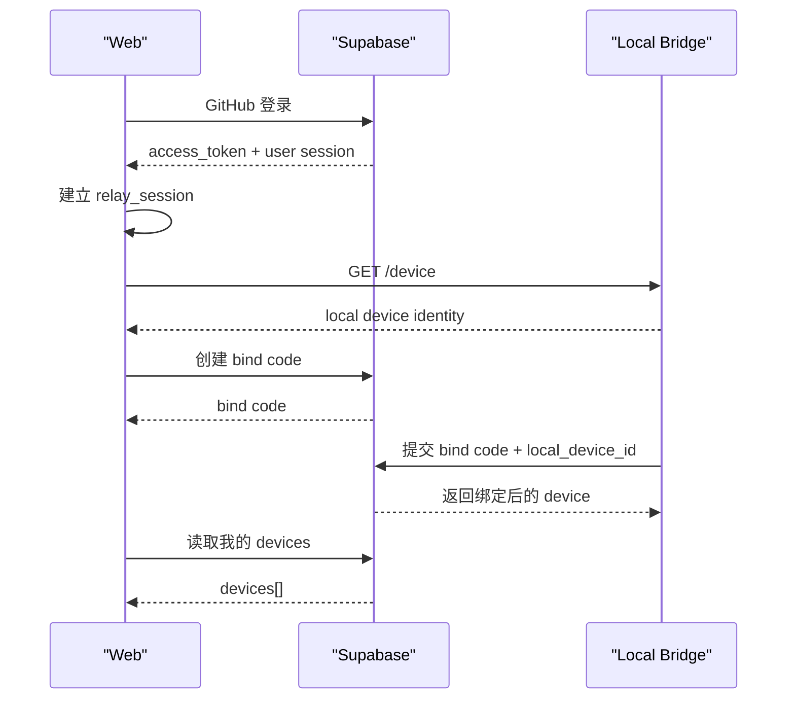

# 09 v0.2.0-alpha 账号与设备绑定设计

## 1. 文档目标

本设计用于把 Relay 从“用户可以登录网页”推进到“用户登录后可以识别并绑定自己的本地设备”。

本阶段不解决完整远程执行，只解决三件事：

1. 网页登录后能识别当前用户
2. 本地 Relay 能暴露稳定的本机设备身份
3. 云端能保存用户与设备的绑定关系

当前这三件事已经完成最小闭环，并进一步推进了三项产品化能力：

1. 查看“我的设备列表”
2. 设置“默认设备”
3. GitHub 登录后自动检测当前本机是否已绑定，并尽量自动通过

---

## 2. 当前实现基线

当前仓库已经具备：

- GitHub 登录已跑通
- `relay_session` 已可保护 Web / Mobile
- `local-bridge` 已可提供本地工作区、会话、运行时 API
- 设置页已新增“账号与设备”区块
- `local-bridge` 已暴露 `GET /device`
- 当前本机设备已真实绑定成功
- 设置页可读取云端设备列表与默认设备
- GitHub 登录回调会自动尝试补齐“本机绑定 + 默认设备”

本轮新增的关键基础能力：

- 本地 session token 不再只是“已登录”，而是包含：
  - `method`
  - `provider`
  - `userId`
- 本地 bridge 拥有稳定的 `deviceId`
- 设备基础模型已进入 shared types

---

## 3. 本阶段范围

### 3.1 这次必须做

- 在本地会话中保留 GitHub 用户身份
- 本地设备有稳定唯一标识
- Supabase 中定义设备与绑定码模型
- 设置页能看到：
  - 当前登录方式
  - 当前用户 ID
  - 当前本机设备信息
  - 当前设备是否已绑定
- 设置页可展示“我的设备列表”
- 设置页可手动设置默认设备
- GitHub 登录后自动检测并尽量自动通过当前本机绑定

### 3.2 这次明确不做

- 云端 Realtime Relay
- 设备在线长连接
- 浏览器按 `deviceId` 转发执行
- 多设备调度
- 绑定码消费流程的完整 UI

---

## 4. 核心对象

### 4.1 本地 session

本地 cookie `relay_session` 需要承载：

- `exp`
- `method`
- `provider`
- `sub`

其中：

- `sub` 对应 Supabase 用户 ID
- 密码登录时 `sub = null`
- GitHub 登录时 `sub = auth.users.id`

这一步的意义：

- 后续所有“查询我的设备”“创建设备绑定码”“选择默认设备”都必须以当前登录用户为起点

### 4.2 本地设备

本地 bridge 维护一个稳定设备对象：

- `id`
- `name`
- `hostname`
- `platform`
- `arch`
- `bindingStatus`
- `boundUserId`
- `createdAt`
- `updatedAt`
- `lastSeenAt`

当前阶段：

- `id` 首次启动生成并持久化
- `bindingStatus` 默认为 `unbound`
- `boundUserId` 先为空

### 4.3 云端设备表

`devices`

用途：

- 保存已经完成账号绑定的设备
- 用于后续在线状态、默认设备、请求路由

关键字段：

- `user_id`
- `local_device_id`
- `name`
- `hostname`
- `platform`
- `arch`
- `status`
- `last_seen_at`

约束：

- `unique(user_id, local_device_id)`

### 4.4 绑定码表

`device_bind_codes`

用途：

- 用户在网页端生成一次性绑定码
- 本地设备提交绑定码完成账号归属

关键字段：

- `user_id`
- `code`
- `requested_local_device_id`
- `requested_device_name`
- `expires_at`
- `consumed_at`
- `consumed_device_id`

### 4.5 默认设备偏好

`user_device_preferences`

用途：

- 保存用户当前默认设备
- 为后续 `v0.2.0-beta` 的“进入工作区即连接默认设备”准备

---

## 5. 最小绑定流程

### 5.1 目标流程

### 5.2 本轮实际落地到哪一步

已经落地：

- `Web -> GitHub 登录`
- `Web -> relay_session`
- `Web -> GET /device`
- `Supabase schema`
- `Web -> 创建 bind code`
- `Bridge -> 提交 bind code`

当前状态：

- 代码层面的最小绑定闭环已经接通
- 用户已在 Supabase 执行 schema 与 RPC SQL
- 真实 E2E 已跑通，当前本机设备已成功绑定
- 设置页已能读取当前账号下的 `devices[]`
- 设置页已能更新 `user_device_preferences.default_device_id`
- GitHub callback 会自动执行：
  - 读取本机设备
  - 读取云端设备目录
  - 如当前设备未绑定则自动绑定
  - 如默认设备为空则自动设置
- `workspace` 入口现在也会执行相同的当前设备检测
- `workspace` 头部现在会明确显示：
  - 当前直连设备
  - 默认设备
  - 当前是否已命中默认设备
- 浏览器创建 bind code 时已经改为显式携带：
  - `Authorization: Bearer <access_token>`
  - `apikey`

当前已知约束：

- 绑定当前设备依赖浏览器里仍然存在有效的 GitHub Supabase session
- 如果本地 Relay session 还在，但浏览器侧 Supabase session 已失效，就需要重新走一次 GitHub 登录

---

## 6. API 合同建议

### 6.1 local-bridge

- `GET /device`
  - 返回本地稳定设备身份

后续将新增：

- `POST /device/bind`
  - 入参：`code`
  - 行为：用绑定码把当前设备绑定到云端账号

当前已经落地：

- `POST /device/bind`
  - bridge 会调用 Supabase RPC `consume_device_bind_code`
  - 绑定成功后会把本地 `bindingStatus` 和 `boundUserId` 持久化

### 6.2 Web / Cloud

后续将新增：

- `POST /api/devices/bind-codes`
  - 当前登录用户创建一次性绑定码
- `GET /api/devices`
  - 返回当前登录用户名下设备
- `PATCH /api/devices/default`
  - 设置默认设备

当前已经落地的 MVP 路径：

- 设置页直接在浏览器里调用 Supabase RPC：
  - `create_device_bind_code`
- 然后立即调用：
  - `/api/bridge/device/bind`

当前实现细节补充：

- `create_device_bind_code` 已改为浏览器显式请求：
  - `POST /rest/v1/rpc/create_device_bind_code`
- 这样可以避免“明明拿到了 access_token，但实际 RPC 是否真的带上了用户鉴权”不透明的问题
- 前端现在也会把 Supabase/plain-object 错误直接展示出来，便于继续排障
- 云端设备目录读取当前使用浏览器 Supabase session 直接查询：
  - `devices`
  - `user_device_preferences`
- 默认设备更新当前使用浏览器 Supabase session 直接 upsert：
  - `user_device_preferences(user_id, default_device_id)`

当前已经落地的产品化补充：

- 设置页新增“我的设备”区块
- 设置页重构为“概览卡 + 内容卡”结构
- 每台设备会显示：
  - 设备名称
  - 主机名
  - 平台
  - 在线状态
  - 是否为“当前这台”
  - 是否为“默认设备”
- 登录后自动执行 `ensureCurrentGitHubDeviceReady()`：
  - 如果当前设备已绑定到当前账号，则自动通过
  - 如果当前设备未绑定，则自动绑定
  - 如果当前账号还没有默认设备，则自动把当前设备设为默认
  - 如果当前设备已绑定到别的账号，则自动停止，不做静默覆盖
- `workspace` 页面也会执行同一套自愈逻辑：
  - 老 session 不必强依赖重新走 OAuth callback
  - 只要当前浏览器仍有有效 GitHub 会话，就会尝试自愈当前设备状态
- 当前仍然没有真正的跨设备执行中继
  - 所以当“默认设备”与“当前直连设备”不一致时，页面会明确提示状态
  - 不会伪装成已经完成了跨设备路由

这样可以先在单人环境中跑通“绑定当前设备”，而不必等待完整的云端 API 层。

---

## 7. 为什么这样拆

如果现在直接做“网页执行请求通过云端路由到本地设备”，问题会混在一起：

- 登录问题
- 设备归属问题
- 长连接问题
- 流式转发问题

对单人团队来说，这会显著增加排障成本。

因此正确拆法是：

1. 先识别用户
2. 再识别设备
3. 再建立归属关系
4. 最后才做远程执行中继

---

## 8. 当前代码落点

- auth session：
  - [`apps/web/src/lib/auth/session.ts`](/Users/ruska/project/web-cli/apps/web/src/lib/auth/session.ts)
  - [`apps/web/src/app/api/auth/session/route.ts`](/Users/ruska/project/web-cli/apps/web/src/app/api/auth/session/route.ts)
- local device：
  - [`services/local-bridge/src/services/local-device-service.ts`](/Users/ruska/project/web-cli/services/local-bridge/src/services/local-device-service.ts)
  - [`services/local-bridge/src/routes/device.ts`](/Users/ruska/project/web-cli/services/local-bridge/src/routes/device.ts)
  - [`apps/web/src/app/api/bridge/device/route.ts`](/Users/ruska/project/web-cli/apps/web/src/app/api/bridge/device/route.ts)
- settings：
  - [`apps/web/src/components/settings-page-client.tsx`](/Users/ruska/project/web-cli/apps/web/src/components/settings-page-client.tsx)
- schema：
  - [`supabase/migrations/20260405090000_device_binding_mvp.sql`](/Users/ruska/project/web-cli/supabase/migrations/20260405090000_device_binding_mvp.sql)
  - [`supabase/migrations/20260405093000_device_binding_rpc.sql`](/Users/ruska/project/web-cli/supabase/migrations/20260405093000_device_binding_rpc.sql)

---

## 9. 下一步

下一轮直接做：

1. 做云端设备在线注册与心跳
2. 准备“默认设备 -> 云端 Relay -> 本地 bridge”的最小路由层
3. 增加“设备冲突 / 已绑定到别的账号”的显式提示
4. 再进入“网页端登录后默认连到自己的本地 Codex”这一步
